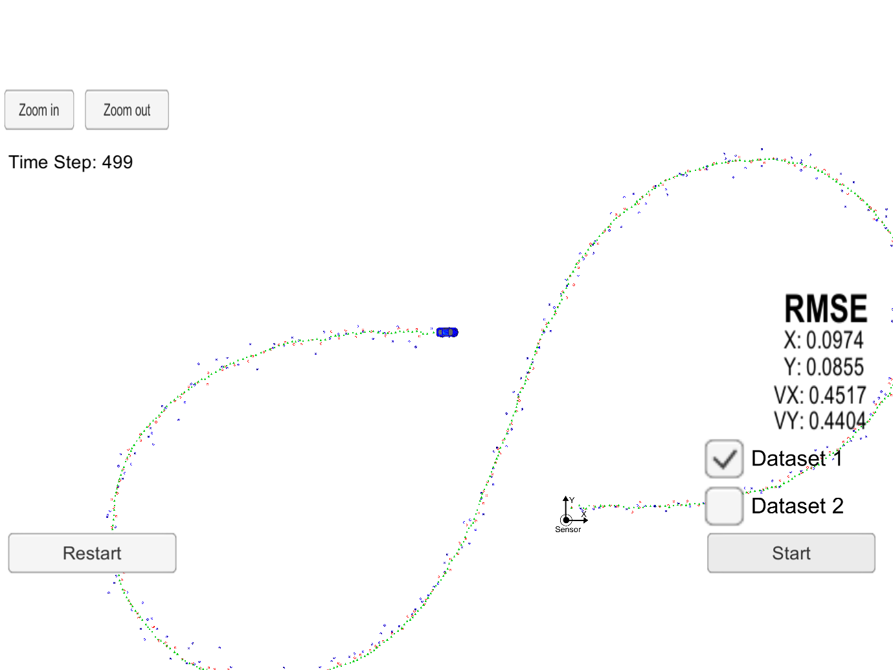

# Extended Kalman Filter Project

### Background
Kalman Filter can be used to estimate the position, velocity of a moving object. The inputs to a Kalman Filter could be a noisy data that might be a representation of the object's position. 

In this project lidar and radar measurements from a car to detect a moving object (eg. a bicycle) is used. By computing the Root Mean Square Error we could determine how good the algorithm is performing.

This project involves a Simulator which can be downloaded [here](https://github.com/udacity/self-driving-car-sim/releases)

Once the install for uWebSocketIO is complete, the main program can be built and run by doing the following from the project top directory.

1. mkdir build
2. cd build
3. cmake ..
4. make
5. ./ExtendedKF

---

## Other Important Dependencies

* cmake >= 3.5
  * All OSes: [click here for installation instructions](https://cmake.org/install/)
* make >= 4.1 (Linux, Mac), 3.81 (Windows)
  * Linux: make is installed by default on most Linux distros
  * Mac: [install Xcode command line tools to get make](https://developer.apple.com/xcode/features/)
  * Windows: [Click here for installation instructions](http://gnuwin32.sourceforge.net/packages/make.htm)
* gcc/g++ >= 5.4
  * Linux: gcc / g++ is installed by default on most Linux distros
  * Mac: same deal as make - [install Xcode command line tools](https://developer.apple.com/xcode/features/)
  * Windows: recommend using [MinGW](http://www.mingw.org/)

## Basic Build Instructions

1. Clone this repo.
2. Make a build directory: `mkdir build && cd build`
3. Compile: `cmake .. && make` 
   * On windows, you may need to run: `cmake .. -G "Unix Makefiles" && make`
4. Run it: `./ExtendedKF `

## Limitations
- It assumes a constant velocity and in reality a car might not be traveling at constant velocity